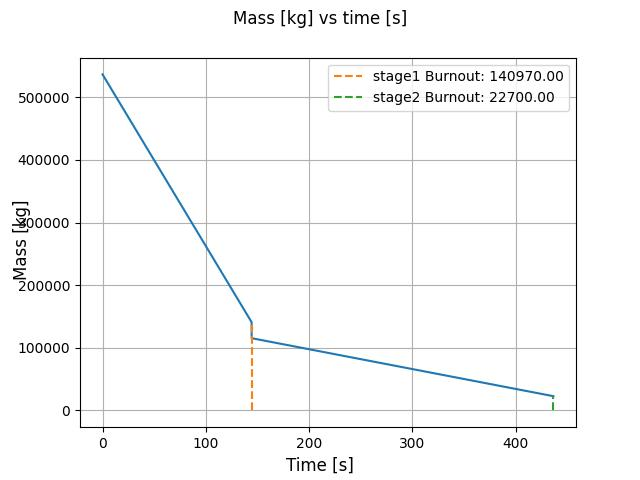
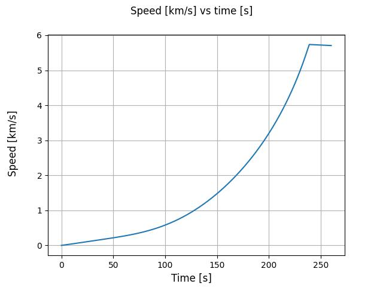
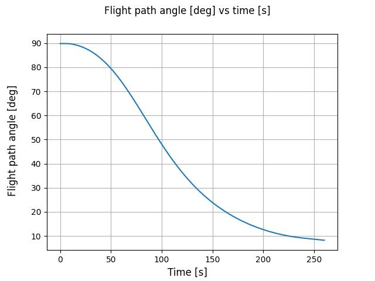
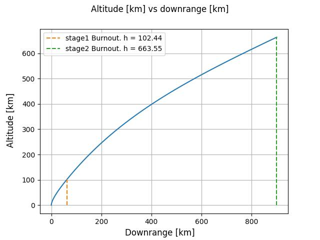

<h1 style="text-align: center;">Final Project - Engineering Degree</h1>

<h2 style="text-align: center;">Análisis y Optimización de Puntos de Lanzamiento para una Constelación Académica de CubeSats: Caso Nano 70/30</h2>

## Overview
This project focuses on simulating the launch stage of different rockets in order to stablish orbit constrains for a constellation of Cubesats.


## Table of content
1) [Current Status](#current-status-as-of-april-25-2026)
2) [Roadmap / Future Work](#roadmap--future-work)
3) [How to use](#how-to-use)
4) [Multistage example](#multistage-example)
5) [Result validation](#result-validation)
6) [Notes](#notes)

## Current status (as of May 05 2026)
The project currently includes:
* Orbit estimator: Allowing to estimate burnout speed based on energy conservation and approximated values of losses due to drag and gravity.

* Equation of motion solver for multistage rockets: Solves the initial value problem for the equation of motion.


## Roadmap / Future Work
Planned improvements include:
* Better implementation of atmosphere model.

* Better implementation of gravity model.

* Use of pyvista instead of matplotlib.

* Altitude and downrange to South-East-Zenith (SEZ).

* SEZ to ECI.


## How to use
1) Install dependencies:
```
pip install numpy scipy matplotlib
```

2) Modify `main.py` script with your rocket parameters

3) Execute `main.py`

## Multistage example

### Mass vs time


### Speed vs time


### Flight path angle vs time


### Range vs altitude


## Result validation
Results validation has been made using Example 13.3 from the book "Orbital Mechanics for Engineering Students".

## Notes

This is an academic project and is actively under development.